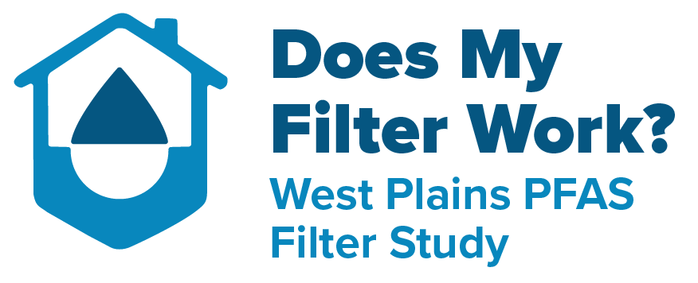

{fig-align="center"}

You've reached the landing page for a collaborative research study by the West Plains Water Coalition and the University of Colorado Boulder. The goal of this study is to help understand the real-world performance of household water filters for removing PFAS from private well water.

For more info, click the links below:

::: {#site-contents}
:::

Have questions or want to follow our progress? Send us an email at [filters\@westplainswater.org](mailto:filters@westplainswater.org).
